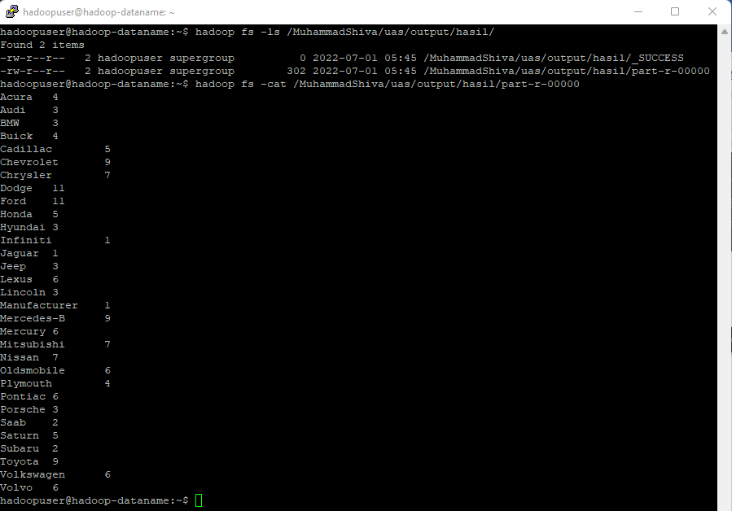

# Hadoop UAS Big Data MAP - REDUCE (Car Sales)
---------------------------------------
> Dosen Pengampu  
> M. Hasyim Ratsanjani, S.Kom., M.Kom.
---------------------------------------
--------------------------
> M. Shiva Matahari Yusda  
> 1941720005 / 11  
> TI - 3D   
--------------------------
### Studi Kasus
Studi Kasus

Data didapatkan dari kaggle dengan nama Car sales, data tersebut terdiri dari :

- Manufacture
- Model
- Sales_in_thousands
- Year_resale_value
- Vehicle_type
- Price_in_thousands
- Engine_size
- Horsepower
- Wheelbase
- Width
- Dari data tersebut, akan dilakukan perhitungan banyaknya Manufacture dari mobil yang telah terjual menggunakan hadoop.

### Hasil Mapreduce Hadoop

### Link Demonstrasi Youtube
https://youtu.be/PkQhSphs2ZI

### Link Laporan 
https://docs.google.com/document/d/1MnPaexKjpHXSQcvgrZ8jG4Nf2nd2CZ1z/edit?usp=sharing&ouid=110731489734304006058&rtpof=true&sd=true

